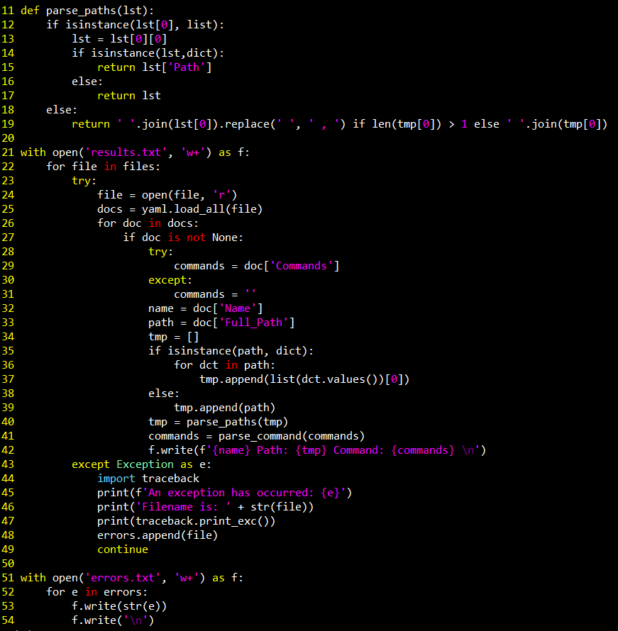

# Hunting for LOLBAS

### Introduction

Like many pentesters I am a big fan of the [LOLBAS](https://github.com/LOLBAS-Project/LOLBAS) project.
and even recently contributed to [it](https://github.com/LOLBAS-Project/LOLBAS/pull/40). Although, the project is 
incredibly useful I couldn't find a tool that automated the process
of finding them so I decided to make one.
Then again how useful are they for redteamers? The answer is incredibly useful.
A recent attack dubbed [Astaroth](https://www.microsoft.com/security/blog/2019/07/08/dismantling-a-fileless-campaign-microsoft-defender-atp-next-gen-protection-exposes-astaroth-attack/) utilized LOLBAS for every step of the attack
after initial compromise. 

With a goal in mind, I turned to Powershell.

### Understanding LOLBAS

Before automating the hunt for LOLBAS it's important to understand 
what they are. LOLBAS stands for living off the land binaries and scripts,
a simple example, as leveraged in my last post is regsvr32. A seemingly
inconspicuous executable being used for code execution. Binaries and scripts
that can be used in creative ways that benefit blueteam and redteam. Blueteam 
as it can show possible attack vectors that should be monitored and understood.
Redteam as utilizing these possible attack vectors if present, may be less likely
noticed and being run by a trusted source.

### Python -> Powershell

With Linux being taken care of by [GTFOBins](https://gtfobins.github.io/)
Windows was next. 
One of the biggest obstacles is that compared to GTFOBins,
LOLBAS is over quadruple the size. Using Python and Bash to quickly
accumulate the files and output the information into an easy way
to copy and paste is great. 


##### Automating the extraction of important information from each file

### Checking the Paths in Powershell

Organizing the information in Powershell was simple, 
using a hash table. The key being the filepath mapped to
an array of the Binary or Script name and an example command
utilizing it. For example:
```powershell
'C:\Windows\explorer.exe' = 'Explorer.exe', 'explorer.exe calc.exe';
```
Path on the left, mapped to the name of the Binary or Script
and an example command utilizing it. 

After creating the hash table the rest is a piece of cake.
```powershell
foreach($path in $dict.Keys){
   Try
    {         
      if(Test-Path -Path $path){
         $paths += $path
      }
    }
    Catch {
      Write-Host "An error occurred:"
      Write-Host $_
    }
 }
 ```
 Just iterate through the keys in the hash table and check
 if the path exists if it does add it to an array. Then at the
 end iterate through the array and pretty print it. 
 Tbe script's name was an obvious choice: 
 [Find-LOLBAS](https://github.com/NotoriousRebel/Find-LOLBAS).

### What's Next?

* Staying up to date with new LOLBAS additions

* Adding different ways to run the script such as through C# in Powershell

* Look into obfuscating payload with Crypt32.dll

### Mitigation
* Adhering to proper block rules such as
[Microsoft recommended block rules](https://docs.microsoft.com/en-us/windows/security/threat-protection/windows-defender-application-control/microsoft-recommended-block-rules)
and utilizing things such as Applocker and Software Restriction Policies 

* Being cognisant of normal network traffic in and out of your system/s is also crucial
as becoming familiar with daily traffic can make it very easy to spot when something is 
out of the ordinary

* Understanding the foundation of each LOLBAS is also important, 
knowing how each one is meant to be used will make it easier to spot when it is
used for malicious purposes. 

Overall awareness is necessary as well, knowing how a LOLBAS should be used
is key. For example, if you've never used regsvr32 before and find it calling out to the internet
that should set off an alarm! 

### Acknowledgements 

This script wouldn't have been possible without the amazing people 
who work on [LOLBAS](https://github.com/LOLBAS-Project/LOLBAS).

Special thanks to [@Bohops](https://twitter.com/bohops) 
for inspiration and [@Oddvarmoe](https://twitter.com/Oddvarmoe)
for the consistent work and maintenance on the 
[LOLBAS](https://github.com/LOLBAS-Project/LOLBAS) project.