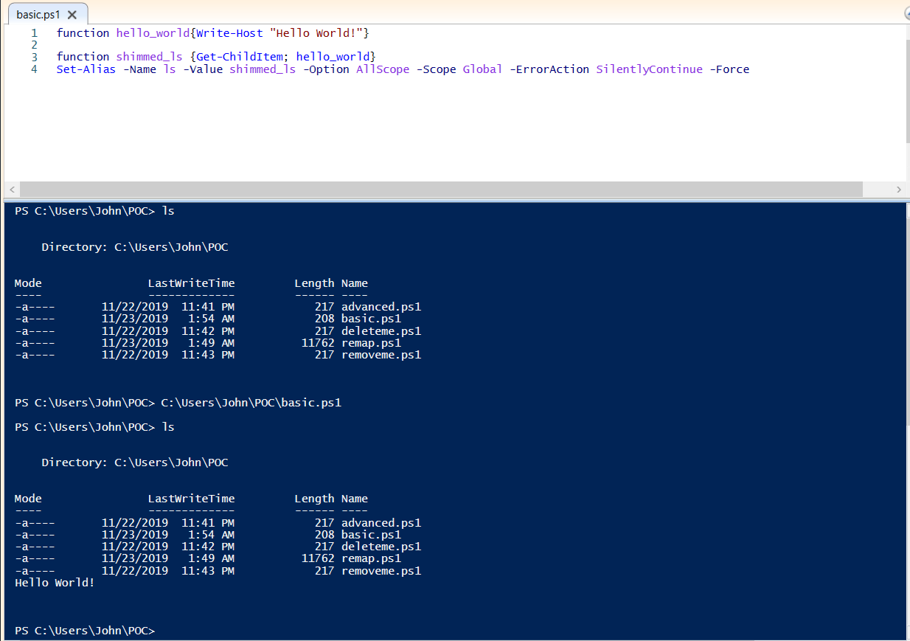
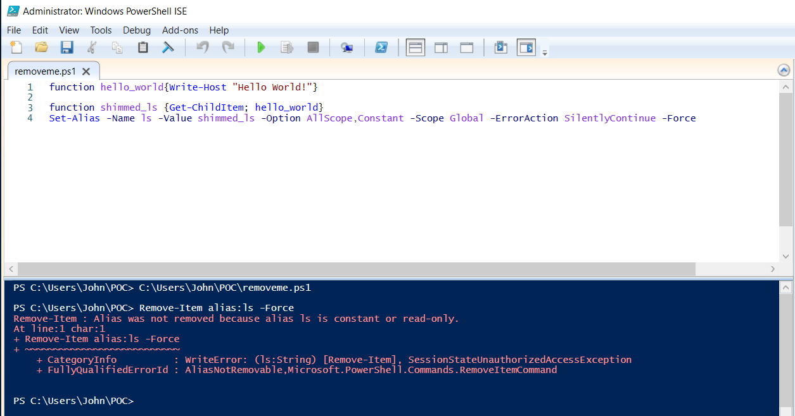
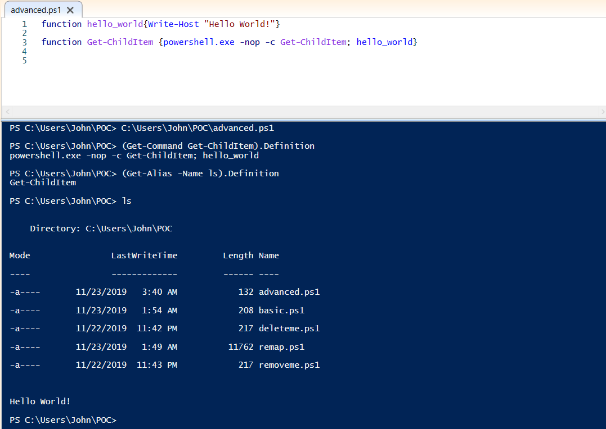
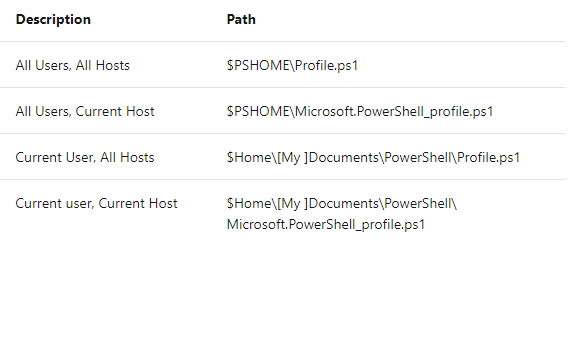
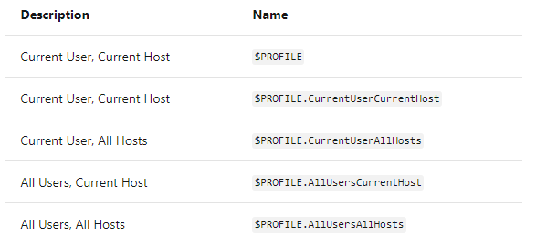

### Introduction
[LOLBAS](https://github.com/LOLBAS-Project/LOLBAS)
In preparation for another [UB Lockdown](https://lockdown.ubnetdef.org/), I had a goal in mind,
work on a new tool for Windows Persistence. It's good to thoroughly understand
other developers tools that have been made such as
[SharpHide](https://github.com/outflanknl/SharpHide/)
or
[SharPerist](https://github.com/fireeye/SharPersist). However, I wanted to create something
from scratch and do something different. The problem I faced was that it's hard to be unique
and create something from scratch when a lot of tools already exist that accomplish your vision. Luckily, I had an idea because when red teaming for Linux one technique for persistence is shimming aliases through .bashrc
or .bash_aliases. However, I could not find any tools or much research in regards to using aliases for red teaming Windows. Thus began my journey!

### Understanding Aliases

With Powershell becoming more and more prevalent for both red teamers
and blue teamers I focused my research into Powershell aliases instead of Command Prompt aliases. By simply doing
Get-Alias in Powershell you will see that a lot of things are aliased, some of the most useful and surprising ones are cat, clear, cp, iex, iwr, and ls. This is only a small snippet out of the 158 built-in aliases with Powershell version 5.
Microsoft defines an alias as: "an alternate name or nickname for a cmdlet or for a command element, such as a function, script, file, or executable file. You can use the alias instead of the command name in any PowerShell commands."

### Basic Shimming with one Alias

Now that we understand what an Alias is and just how prevalent they are
in Powershell now it's time to shim one. Let's shim the alias ls as it is fairly common. First let's see what the ls alias is defined as, to do that we simply type <br/>

```powershell
(Get-Alias -Name ls).Definition
```

This returns Get-ChildItem which is what ls is aliased to.



As we can see here the alias for ls has been redefined to:

```powershell
{Get-ChildItem; hello_world}
```

hello_world being our function that simply prints Hello World!

Let's break down what we are actually doing:

hello_world function simply prints Hello World!
shimmed_ls is the name of the function we are going to realias ls to
this function simply does Get-ChildItem which is what ls was originally mapped to.
Now it is realiased to Get-ChildItem; hello_world

Lastly, let's break the command that sets the alias.

```powershell
Set-Alias -Name ls -Value shimmed_ls -Option AllScope -Scope Global -ErrorAction SilentlyContinue -Force
```

- **Name ls**: Name of our alias we are realiasing

- **Value shimmed_ls**: What we are realiasing ls to

- **Option AllScope**: Alias is copied to any new scopes that are created

- **Scope Global**: Scope in which alias is valid. Global means scope is in effect when PowerShell starts.

- **ErrorAction**: If an error should occur for whatever reason it will not error display an error message user as that may alert the user, rather just silently continue.

- **Force**: This is required as the majority of built-in PowerShell aliases are ReadOnly which means they cannot be changed or deleted unless the Force parameter is used. To see which aliases are ReadOnly do: 

```powershell
Get-Alias | Where-Object {$_.Options -Match "ReadOnly"}
```

### Basic Removal of the Shim

Now that we have remapped an alias, you're probably
wondering how do I remove it?

The answer is simple as we can just do:
```powershell
Remove-Alias -Name ls -Force
Or
Remove-Item alias:ls -Force
```
That works just fine as ls is no longer aliased our shim no longer works.

<br/>

However, we can fix that :)

<br/>

Now when you do Set-Alias instead of  **-Option AllScope** do
**-Option AllScope, Constant**

Let's try deleting it now, we will even run PowerShell as an administrator



PowerShell now throws an error as the alias is a constant!

### Taking it one Step Further

Now that we have learned how to realias aliases to our shimmed version
wouldn't it be nice to just cut out the middle man. Instead of relaliasing aliases
let's just redefine what the alias is defined as!

Back to our favorite example with ls
we saw that it was aliased to Get-ChildItem so lets try redefining
what Get-ChildItem is:



Get-ChildItem has been redefined to spawn a powershell session that simply calls Get-ChildItem. PowerShell is called with the flag -nop short for NoProfile as to not load profiles.

### PowerShell Profiles to the Rescue

There is one big problem with aliasing, our shimmed aliases
only exist within the current PowerShell session.
That means when a user opens up a new PowerShell session all our hard work
is lost. Luckily, PowerShell profiles exist, a profile is a PowerShell script that runs whenever the user opens up PowerShell. Profiles are documented in the MITRE attack
framework as
[T1504](https://attack.mitre.org/techniques/T1504/")
. What this means for us is that we need to create that special profile called profile.ps1 that will load our malicious shims whenever a user opens up PowerShell.

**The Four Different Locations of Powershell Profiles**:



**$PSHOME = C:\Windows\System32\WindowsPowerShell\v1.0**

<br/>

**$HOME = C:\Users\[User]**

#### You can also do



The two we are focusing on are:

### $PROFILE.CurrentUserAllHosts** and **$PROFILE.AllUserAllHosts

<br/>

**$PROFILE.CurrentUserAllHosts = C:\Users\\[User]\Documents\WindowsPowerShell\profile.ps1**

**$PROFILE.AllUserAllHosts = C:\Windows\System32\WindowsPowerShell\v1.0\profile.ps1**

To write to the latter of the two we need to have administrative permissions
on the box. An interesting tidbit to note is that when PowerShell first runs it will check if the profile for all users has been created and if that doesn't exist it will use the profile for the current user if it exists.

Keep in mind PowerShell Profiles do not exist by default, you will have to create those files.

### Putting All the Pieces Together

With so many aliases in PowerShell and having to create the PowerShell Profiles, it could seem daunting to do this manually. Luckily you don't have to as I created a simple PowerShell script called Remapper which does all of the hard work for you! The only thing you may wish to modify are the functions in the first lines of the script. These funcions are what will be called when an alias is run.

**What the script does:**

- Get paths of profiles and create them if they don't exist

- Create a dictionary mapping aliases to shimmed definitions for the majority of aliases.

- Puts the code to rewrite every alias into both PowerShell profiles.

**Our shimmed function does four things**:

- Do what the alias is originally meant for

- Start a job to restore firewall to default settings

- Start a job to turn off real-time monitoring

- Check if google&#46;com is in the hosts file, if not will add it because during competitions we don't blue teamers using Google ;).

Let's run the script as an administrator and see what happens!


As can be seen, both profiles have been modified and if we do Get-Alias everything has been shimmed. Now when we type an alias it will run our shimmed version of it :)

The script can be found here:
[Remapper](https://github.com/NotoriousRebel/Remapper)

### Mitigation

- Monitoring of PowerShell Profile locations to look for either creation of the file or someone writing to it.

- Checking what aliases are defined as

- Avoiding the use of aliases; although, if you dig into PowerShell's
  source code you will see some commands use aliases!

- Avoiding Powershell Profiles all together using the flag -No Profile when using PowerShell.

- Powershell Logging 

### What's Next?

- Looking into shimming aliases for Command Prompt sessions

- Looking into CLR hooking instead of PowerShell profiles.

- Researching the shimming of built-in PowerShell functions.

### Closing Thoughts

The concept of realiasing things in PowerShell is very fascinating, I have not seen too much research on it and would be curious to see just how far you can take it.
Overall, I hope this blog post gets people interested in the topic and can serve to be another neat trick for red teamers. While also giving blue teamers something else to watch out for.

## References

- [https://attack.mitre.org/techniques/T1504/](https://attack.mitre.org/techniques/T1504/)

- [https://docs.microsoft.com/en-us/powershell/module/microsoft.powershell.core/about/about_aliases?view=powershell-6](https://docs.microsoft.com/en-us/powershell/module/microsoft.powershell.core/about/about_aliases?view=powershell-6)

- [https://docs.microsoft.com/en-us/powershell/module/microsoft.powershell.core/about/about_profiles?view=powershell-6](https://docs.microsoft.com/en-us/powershell/module/microsoft.powershell.core/about/about_profiles?view=powershell-6)

- [https://docs.microsoft.com/en-us/powershell/module/microsoft.powershell.utility/get-alias?view=powershell-6](https://docs.microsoft.com/en-us/powershell/module/microsoft.powershell.utility/get-alias?view=powershell-6)

- [https://docs.microsoft.com/en-us/powershell/module/microsoft.powershell.utility/set-alias?view=powershell-6](https://docs.microsoft.com/en-us/powershell/module/microsoft.powershell.utility/set-alias?view=powershell-6)

- [https://docs.microsoft.com/en-us/powershell/module/microsoft.powershell.utility/remove-alias?view=powershell-6](https://docs.microsoft.com/en-us/powershell/module/microsoft.powershell.utility/remove-alias?view=powershell-6)