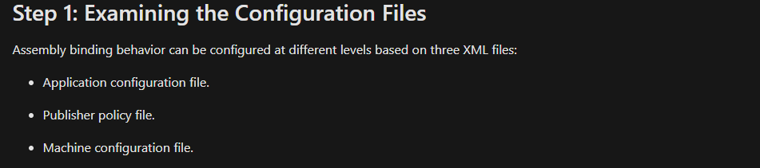
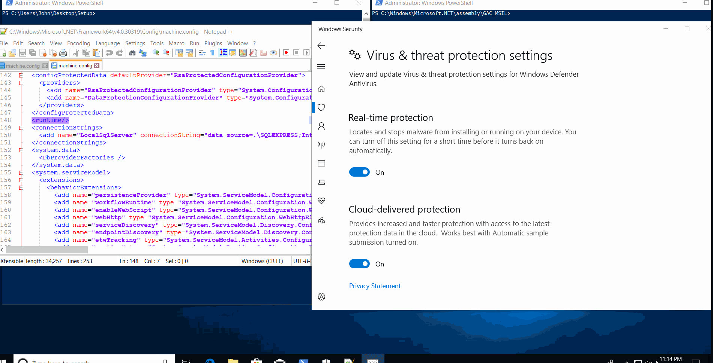

### Introduction

Preparing for an upcoming red teaming competition and becoming one with the msdn documents, 
I stumbled across something very interesting. You may have noticed that when you create a project
with visual studio that is based on the .NET Framework an app.config is created. 
A typical app.config looks like:

```xml
<?xml version="1.0" encoding="utf-8" ?>
<configuration>
    <startup> 
        <supportedRuntime version="v4.0" sku=".NETFramework,Version=v4.7.2" />
    </startup>
</configuration>
```

- Configuration Element: Root element in every configuration file used by the common language runtime and .NET Framework applications.
- Startup Element: Specifies Common Language Runtime (CLR) startup information
- Version: Specifies version of CLR this app 
- Sku: Specifies which .NET Framework release this app supports


That's great but why should you care? Remember what was just said: "Root element in every configuration file."
There are more configuration files besides app.config :) 
This is where our journey begins.

### Note:

This post does not cover the internals of things such as: GAC, CLR, or strong signed .NET assemblies. If you need a primer on those
I encourage you to check out [am0nsec's](https://twitter.com/am0nsec) 
[post](https://www.contextis.com/en/blog/common-language-runtime-hook-for-persistence) covering
a different technique for CLR hooking.

### Digging Deeper

Exactly what other config files exist? 
But before we get to that we must first understand how the runtime locates assemblies.
There are four steps:

1. Examining the Configuration Files
2. Checking for Previously Referenced Asemblies
3. Checking the Global Assembly Cache
4. Locating the Assembly through Codebases or Probing

The first step is what we will be focusing on, there 
are three configuration files.

<div className="Image__Medium">
  
</div>

We already covered the application configuration file but what 
about the other two? 

* The publisher policy file
* Distributed by a component publisher as a fix or update to a shared component.
* Affects all applications that use a shared component.

And finally: 

- The machine configuration file

* Takes precedence over all other configuratin settings
* Applies to entire computer
* File resides on local computer in config subdirectory
* Can be used by administrators to specify assembly binding restrictions that are local to that computer
* Requires administrative permissions to Modify

### Understanding machine.config

Where is it located?

Simply type this in PowerShell:

```powershell
[System.Runtime.InteropServices.RuntimeEnvironment]::SystemConfigurationFile
```
You will most likely get:
**C:\Windows\Microsoft.NET\Framework64\v4.0.30319\config\machine.config**

There is also one here:
**C:\Windows\Microsoft.NET\Framework64\v2.0.50727\config\machine.config**

**There are also config files in the 32 bit version of the .NET Framework as well**

According to Microsoft:

When locating assemblies within machine.config the configuration system
will first examine the appSettings element and other 
sections that a developer has defined.

It's those other sections that allow us to get persistence.
One section in particular stands out:
the runtime section!

In total the runtime section and its parent and child elements
total to 55 items.

However, we only care about two:

1. [appDomainManagerType](https://docs.microsoft.com/en-us/dotnet/framework/configure-apps/file-schema/runtime/appdomainmanagertype-element)
2. [appDomainManagerAssembly](https://docs.microsoft.com/en-us/dotnet/framework/configure-apps/file-schema/runtime/appdomainmanagerassembly-element)

### Understanding appDomainManager & appDomainManagerAssembly

To understand why we care about those two elements we must understand
what an AppDomain is. AppDomains allow third-party untrusted
code to run in an existing process. An AppDomain is a logical container for a set of assemblies.
The appDomainManager class allows a host to override CLR default behavior by
using managed code instead of using unmanged code.
We need to create a class that derives from AppDomainManager
which initializes a new domain.The appDomainManager can be set in a configuration file
by using the appDomainManagerAssembly and appDomainManagerType elements.
The class needs to be installed into the GAC because the assembly needs to be granted full-trust,
all assemblies in the GAC are always granted full-trust.

**TLDR:**
We can create a class that derives from appDomainManager class
that intializes a new domain to run our code.
The InitializeNewDomain method is called on the new instance of AppDomainManager.
We are hooking all calls to AppDomain.CreateDomain to our AppDomainManager which in turn will run our code.


### Putting the Pieces Altogether

Now that we understand what machine.config and what appDomains are 
and how we can leverage it. It's time put all the pieces together
to accomplish persistence we have a few things we need to do:

1. Generate a keyfile simply do that with sn -k key.snk, [sn](https://docs.microsoft.com/en-us/dotnet/framework/tools/sn-exe-strong-name-tool) standing for strong name tool
2. Create a strong signed .NET assembly using our newly created keyfile
    that assembly will be implementing an AppDomainManager
    and overriding InitiliazeNewDomain
3. Install that assembly onto the GAC using [gacutil](https://docs.microsoft.com/en-us/dotnet/framework/tools/gacutil-exe-gac-tool) or C#.
4. Modify machine.config's runtime element attribute with the appDomainType and appDomainManagerAssembly elements:

To get the appDomainManagerAssembly you can 
```xml
<runtime>  
    <appDomainManagerType value="Context Name" />  
    <appDomainManagerAssembly   
        value="Signed, Version=1.0.0.0, Culture=neutral, PublicKeyToken=token" />  
</runtime> 
```

Luckily machine.config is simply an xml file so we can use so it was easy to modify
there also exists the [System.Configuration](https://docs.microsoft.com/en-us/dotnet/api/system.configuration) namespace which I also could've utilized; 
however, xml was personally much easier to use.

### Demo Time

Putting all those pieces together in a simple program
that just requires you to put the keyfile in the correct spot automates
the process :)

Assemblies installed onto the GAC are located here:
**C:\Windows\Microsoft.NET\assembly**
You will most likely see three folders:

- **GAC_32** : For assemblies targeting 32-bit platforms
- **GAC_64** : For assemblies targeting 64-bit platforms
- **GAC_MSIL** : For assemblies targeting both 32-bit and 64-bit platforms

You will notice our strong named assembly called test is installed in GAC_MSIL

One of the most important parts is where we create the class that 
inherits from appDomainManager:

```C#
var malCSharp = @"using System;
                namespace Context {
                    public sealed class ConfigHooking : AppDomainManager {
                        public override void InitializeNewDomain(AppDomainSetup appDomainInfo) {
                            System.Diagnostics.Process.Start(""calc.exe"");
                            return;
                        }
                    }
                }
            ";
```




The full code can be found here:
[ConfigPersist](https://github.com/NotoriousRebel/ConfigPersist/)


### Mitigation

- Monitoring of assemblies installed onto GAC
- Monitoring modifications to machine.config

### What's Next?

- Look into creating configs for any arbitrary .NET assembly
- Dig deeper into just how powerful machine.config is
- Research .NET Core runtime persistence mechanisms

### Closing Thoughts

The concept of leveraging built in config files for persistence is quite fascinating
as with the shift from PowerShell to .NET tradecraft, .NET attacks will become
much more common and frequent.

Shout outs to:
- [am0nsec's](https://twitter.com/am0nsec) for the amazing post
on CLR hooking as well as insightful information on the .NET framework 
- [subTee](https://twitter.com/subTee) for motivating me to work harder
and for his research on the topic as well.


## References

- [https://docs.microsoft.com/en-us/dotnet/framework/configure-apps/](https://docs.microsoft.com/en-us/dotnet/framework/configure-apps/)
- [https://docs.microsoft.com/en-us/dotnet/framework/deployment/how-the-runtime-locates-assemblies](https://docs.microsoft.com/en-us/dotnet/framework/deployment/how-the-runtime-locates-assemblies)
- [https://docs.microsoft.com/en-us/dotnet/framework/configure-apps/file-schema/runtime/runtime-element](https://docs.microsoft.com/en-us/dotnet/framework/configure-apps/file-schema/runtime/runtime-element)
- [https://docs.microsoft.com/en-us/dotnet/framework/configure-apps/file-schema/startup/supportedruntime-element](https://docs.microsoft.com/en-us/dotnet/framework/configure-apps/file-schema/startup/supportedruntime-element)
- [https://docs.microsoft.com/en-us/dotnet/api/system.appdomain](https://docs.microsoft.com/en-us/dotnet/api/system.appdomain)

