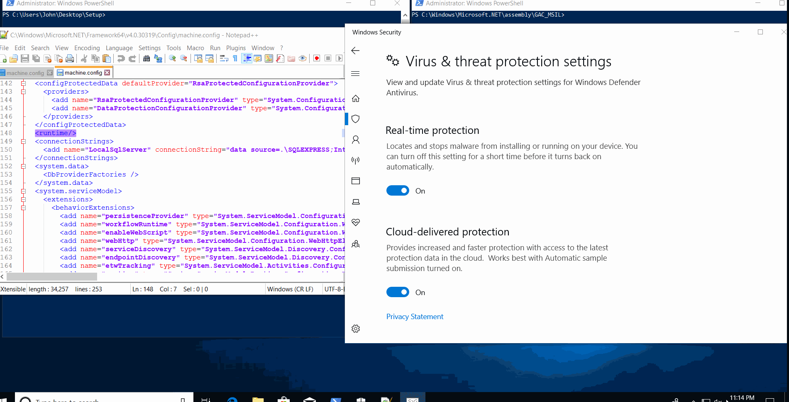

### Introduction

Preparing for an upcoming red teaming competition and "becoming" one with the MSDN documents, 
I stumbled across something very interesting. You may have noticed that when you create an .NET Framework application
with Visual Studio an app.config is created. 
A typical app.config looks like:

```xml
<?xml version="1.0" encoding="utf-8" ?>
<configuration>
    <startup> 
        <supportedRuntime version="v4.0" sku=".NETFramework,Version=v4.7.2" />
    </startup>
</configuration>
```

- Configuration: Root element in every configuration file used by the Common Language Runtime  (CLR) and .NET Framework applications
- Startup: Element specifies the CLR startup information
- Version: Specifies version of the CLR the app supports 
- Sku: Specifies which .NET Framework release the app supports


That's great but why should you care? Remember what was just said, "Root element in every configuration file."
There are more configuration files besides app.config. 
This is where our journey begins.

### Note

This post does not cover the internals of things such as Global Assembly Cache (GAC), CLR, or strong signed .NET assemblies. 
If you need a primer on those,
I highly suggest you check out [am0nsec's](https://twitter.com/am0nsec) 
[post](https://www.contextis.com/en/blog/common-language-runtime-hook-for-persistence) covering
a different technique for CLR hooking.

### Digging Deeper

Exactly what other config files exist? 
Before we get to that, we must first understand how the runtime locates assemblies.
There are four steps in the process:

1. Examining the configuration files
2. Checking for previously referenced assemblies
3. Checking the global assembly cache
4. Locating the assembly through codebases or probing

The first step is what we will be focusing on. 
There are three configuration files.

<div className="Image__Medium">
  
</div>

We already covered the application configuration file.
But what about the other two?

* The publisher policy file
* Distributed by a component publisher as a fix or update to a shared component.
* Affects all applications that use a shared component.

**And finally:**

The machine configuration file
* Takes precedence over all other configuration settings
* Applied to the entire machine.
* Resides on the local computer in the config subdirectory
* Can be used by administrators to specify assembly binding 
restrictions that are local to the computer
* Requires administrative permissions to modify

### Understanding machine.config

Where is it located?

Simply type this in PowerShell:

```powershell
[System.Runtime.InteropServices.RuntimeEnvironment]::SystemConfigurationFile
```
You will most likely get:
C:\Windows\Microsoft.NET\Framework64\v4.0.30319\config\machine.config

There is also one here:
C:\Windows\Microsoft.NET\Framework64\v2.0.50727\config\machine.config

**There are also config files in the 32-bit version of the .NET Framework.**

According to Microsoft:

When locating assemblies within machine.config the configuration system
will first examine the appSettings element and other 
sections that a developer has defined.

It's those other sections that allow us to get persistence. 
One section in particular stands out, the runtime section!

In total, the runtime section, its parent and child elements
total 55 items.

However, we only care about two:

1. [appDomainManagerType](https://docs.microsoft.com/en-us/dotnet/framework/configure-apps/file-schema/runtime/appdomainmanagertype-element)
2. [appDomainManagerAssembly](https://docs.microsoft.com/en-us/dotnet/framework/configure-apps/file-schema/runtime/appdomainmanagerassembly-element)

### Understanding appDomainManager & appDomainManagerAssembly

To understand why we care about those two elements, we must first understand
what an AppDomain is. AppDomains allow  untrusted third-party
code to run in an existing process, essentially a logical container for a set of assemblies.
The appDomainManager class allows a host to override CLR default behavior by
using managed code instead of unmanaged code.


In order to achieve this, we need to create a class that derives from AppDomainManager
which initializes a new domain. The appDomainManager element can be configured in the runtime section 
of a configuration file. This is accomplished via the elements appDomainManagerAssembly and appDomainManagerType.
The class that derives from AppDomainManager 
needs to be installed into the GAC because
the assembly needs to be granted full-trust.
All assemblies in the GAC are always granted full-trust.

**TLDR:**
We can create a class that derives from appDomainManager class
that initializes a new domain to run our code.
The InitializeNewDomain method is called on the new instance of AppDomainManager.
Allowing us to hook all calls to AppDomain.CreateDomain to our AppDomainManager which in turn will run our code.


### Putting the Pieces Altogether

Now that we understand what machine.config and appDomains are 
and how we can leverage them, it's time put all the pieces together
to accomplish persistence. There are a few things we need to perform:

1. Generate a keyfile. Simply do that with sn -k key.snk, [sn](https://docs.microsoft.com/en-us/dotnet/framework/tools/sn-exe-strong-name-tool) standing for strong name tool
2. Create a strong signed .NET assembly using our newly created keyfile
    with an assembly that derives from AppDomainManager
    and overrides InitiliazeNewDomain
3. Install that assembly onto the GAC using [gacutil](https://docs.microsoft.com/en-us/dotnet/framework/tools/gacutil-exe-gac-tool),
C# via [Publish.GacInstall](https://docs.microsoft.com/en-us/dotnet/api/system.enterpriseservices.internal.publish.gacinstall),
or PowerShell via this amazing [script](https://gitlab.com/snippets/1878274)
4. Modify machine.config's runtime element attribute with the appDomainType and appDomainManagerAssembly elements:

To get the appDomainManagerAssembly you can 
```xml
<runtime>  
    <appDomainManagerType value="Context Name" />  
    <appDomainManagerAssembly   
        value="Signed, Version=1.0.0.0, Culture=neutral, PublicKeyToken=token" />  
</runtime> 
```

Luckily machine.config is simply an xml file so we can use so it was easy to modify.
There also exists the [System.Configuration](https://docs.microsoft.com/en-us/dotnet/api/system.configuration) 
namespace, which also could have been utilized. 
However, the xml method was personally much easier to use.

### Demo Time

Putting all those pieces together in a simple program
which just requires you to put the keyfile in the 
correct spot. This automates the process :)

Assemblies installed onto the GAC are located here:

C:\Windows\Microsoft.NET\assembly
You will most likely see three folders:

**GAC_32** : For assemblies targeting 32-bit platforms
**GAC_64** : For assemblies targeting 64-bit platforms
**GAC_MSIL** : For assemblies targeting both 32-bit and 64-bit platforms

You will notice our strong-named assembly called test is installed in GAC_MSIL

One of the most important parts is where we create the class that 
inherits from appDomainManager:

```csharp
using System;
    namespace Context {
        public sealed class ConfigHooking : AppDomainManager {
            public override void InitializeNewDomain(AppDomainSetup appDomainInfo) {
                System.Diagnostics.Process.Start(""calc.exe"");
                return;
            }
        }
    }
```




The full code can be found here:
[ConfigPersist](https://github.com/NotoriousRebel/ConfigPersist/)

### Creating Configs for Arbitrary .NET Assemblies

Thank you to subtee for the amazing research on this technique.
Remember what was said earlier about how the runtime locates assemblies.
Specifically number 4:

**Locating the assembly through codebases or probing**

We can also take any arbitrary .NET assembly
for example, FileHistory.exe and create a custom config for it
such as FileHistory.exe.config looking like this:

```xml
<configuration>
   <runtime>
      <assemblyBinding xmlns="urn:schemas-microsoft-com:asm.v1">
         <probing privatePath="C:\Windows\System32\com;" />
      </assemblyBinding>
      <appDomainManagerAssembly value="ArbConfig, Version=0.0.0.0, Culture=neutral, PublicKeyToken=null" />
      <appDomainManagerType value="MyAppDomainManager" />
   </runtime>
</configuration>
```

ArbConfig being the name of the unsigned assembly.
We can then simply place that config file
inside System32 and the next time FileHistory.exe
is ran our code will be ran instead.

1. Create your assembly that derives from AppDomainManager.
2. Place your unsigned assembly in the same directory
as the .NET assembly you want to affect.
3. Modify your config with the privatePath being equal
to where you placed your assembly.
4. Place the config file in the same directory or a subdirectory
as the .NET assembly you want to affect.

Second Demo:


The code for ArbConfig.dll:

```csharp
using System;
using System.Reflection;
using System.EnterpriseServices;
using System.Runtime.InteropServices;

public sealed class MyAppDomainManager : AppDomainManager
{
    public override void InitializeNewDomain(AppDomainSetup appDomainInfo)
    {
        System.Windows.Forms.MessageBox.Show("Config Files are fun");
        return;
    }
}
```


### Mitigation

- Monitoring for modifications to machine.config
- Monitoring for dynamic compilation of C# code

### What's Next?

- Look into automating the creation of configs for any arbitrary .NET assembly
- Dig deeper into just how powerful machine.config is
- Research .NET Core runtime persistence mechanisms

### Closing Thoughts

The concept of leveraging built-in config files for persistence is quite fascinating
as with the shift from PowerShell to .NET tradecraft, .NET attacks will become
much more common and frequent.

**Shout outs to:**
- [am0nsec](https://twitter.com/am0nsec) for the amazing post
on CLR hooking and for his awesome suggestions on this post.
- [subTee](https://twitter.com/subTee) for motivating me to work harder
and for his amazing research on the topic as well.


## References

- [https://docs.microsoft.com/en-us/dotnet/framework/configure-apps/](https://docs.microsoft.com/en-us/dotnet/framework/configure-apps/)
- [https://docs.microsoft.com/en-us/dotnet/framework/deployment/how-the-runtime-locates-assemblies](https://docs.microsoft.com/en-us/dotnet/framework/deployment/how-the-runtime-locates-assemblies)
- [https://docs.microsoft.com/en-us/dotnet/framework/configure-apps/file-schema/runtime/runtime-element](https://docs.microsoft.com/en-us/dotnet/framework/configure-apps/file-schema/runtime/runtime-element)
- [https://docs.microsoft.com/en-us/dotnet/framework/configure-apps/file-schema/startup/supportedruntime-element](https://docs.microsoft.com/en-us/dotnet/framework/configure-apps/file-schema/startup/supportedruntime-element)
- [https://docs.microsoft.com/en-us/dotnet/api/system.appdomain](https://docs.microsoft.com/en-us/dotnet/api/system.appdomain)
- [https://docs.microsoft.com/en-us/previous-versions/dotnet/netframework-4.0/15hyw9x3(v=vs.100)](https://docs.microsoft.com/en-us/previous-versions/dotnet/netframework-4.0/15hyw9x3(v=vs.100))
