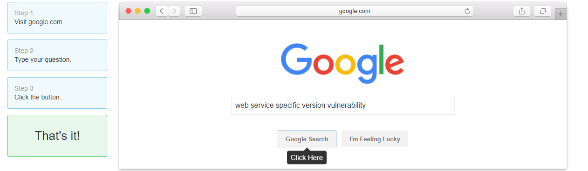

### Introduction

When you start an engagement for a penetration test one of the most
crucial steps is proper recon. But what exactly does that boil down to?

Make sure to keep in mind scope while performing your recon.

Start at the network level and gather as much information as possible
make sure to keep track of it in an organized manner. You can use notaking applications
such as [Cherrytree](https://www.giuspen.com/cherrytree/) or [Notion](https://www.notion.so/)

If you are given an IP range nmap is your friend! 

Some useful flags for nmap
```
-sV service scan
-sC default script scan
-p- All ports
-T4 aggressive scanning to increase speed
-oA output all formats
-v verbose output
-A enabling of os detection, version detection, script scanning
```

### Don't forget about nse scripts :) 

Fingerprinting is a key aspect, whether it be fingerprinting to find out the OS or
a specific web service version. 

Sometime's it's as simple as 



Exploitdb is also your friend and utilizing the commandline version with searchsploit or 
their website can lead to an easy win. 

Make sure to check out the resources down below, stay organized,
stay coordinated, and if all else fails try harder :) 

## Useful tools

[https://github.com/leebaird/discover](https://github.com/leebaird/discover)

[https://github.com/darkoperator/dnsrecon](https://github.com/darkoperator/dnsrecon)

[https://github.com/Tib3rius/AutoRecon](https://github.com/Tib3rius/AutoRecon)

[https://github.com/lanmaster53/recon-ng](https://github.com/lanmaster53/recon-ng)

[https://github.com/phra/rustbuster](https://github.com/phra/rustbuster)

[https://github.com/OJ/gobuster](https://github.com/OJ/gobuster)

[https://github.com/sensepost/gowitness](https://github.com/sensepost/gowitness)

The list goes on and on, these are just a few search around on github and you will find so much more.

## Resources


[https://medium.com/@ehsahil/recon-my-way-82b7e5f62e21](https://medium.com/@ehsahil/recon-my-way-82b7e5f62e21)

[https://www.infopulse.com/blog/pentesters-training-and-practice-recon-active-information-gathering-and-vulnerability-search/](https://www.infopulse.com/blog/pentesters-training-and-practice-recon-active-information-gathering-and-vulnerability-search/)

[https://pentester.land/cheatsheets/2019/04/15/recon-resources.html](https://pentester.land/cheatsheets/2019/04/15/recon-resources.html)

[https://medium.com/dvlpr/penetration-testing-methodology-part-1-6-recon-9296c4d07c8a](https://medium.com/dvlpr/penetration-testing-methodology-part-1-6-recon-9296c4d07c8a)

[https://medium.com/@maverickNerd/recon-everything-48aafbb8987](https://medium.com/@maverickNerd/recon-everything-48aafbb8987)