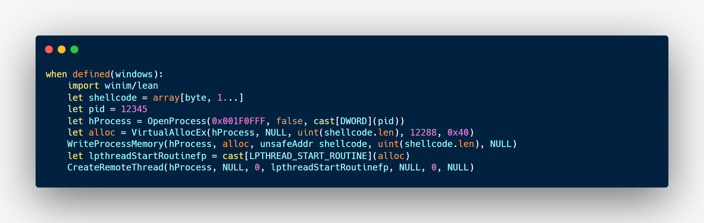
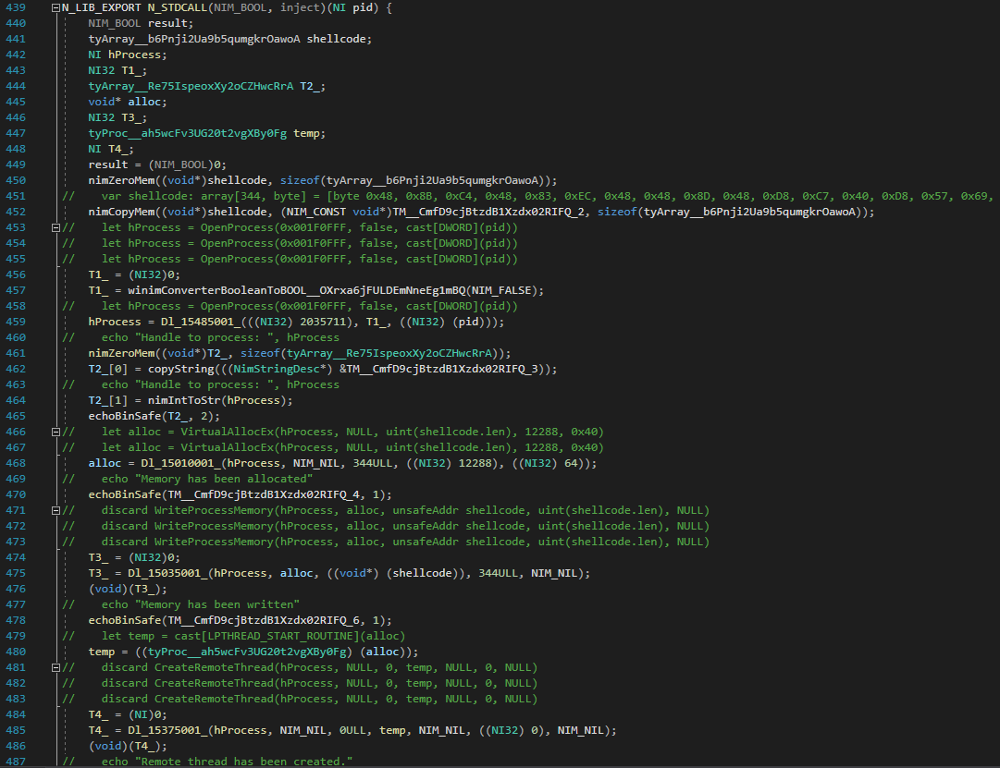
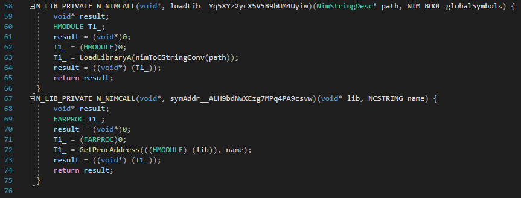
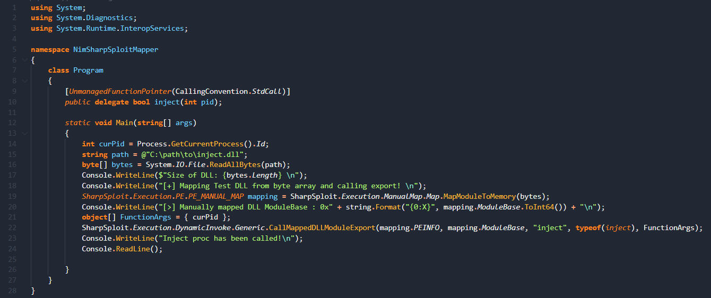
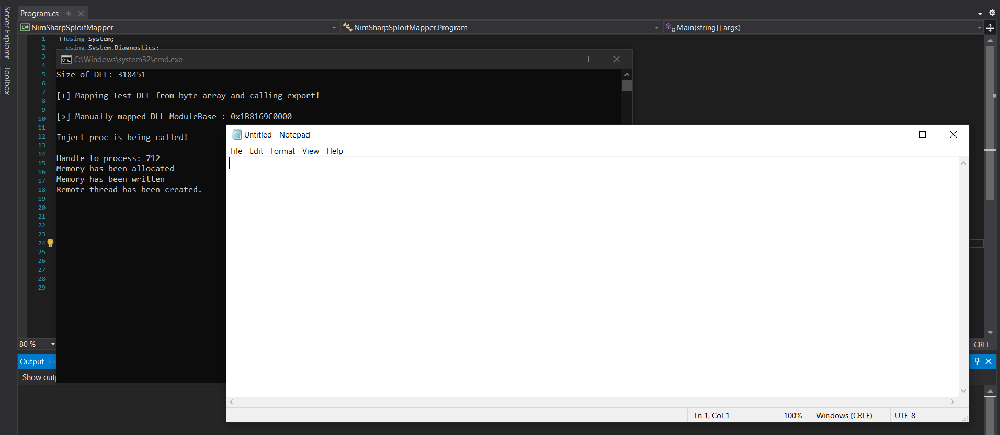
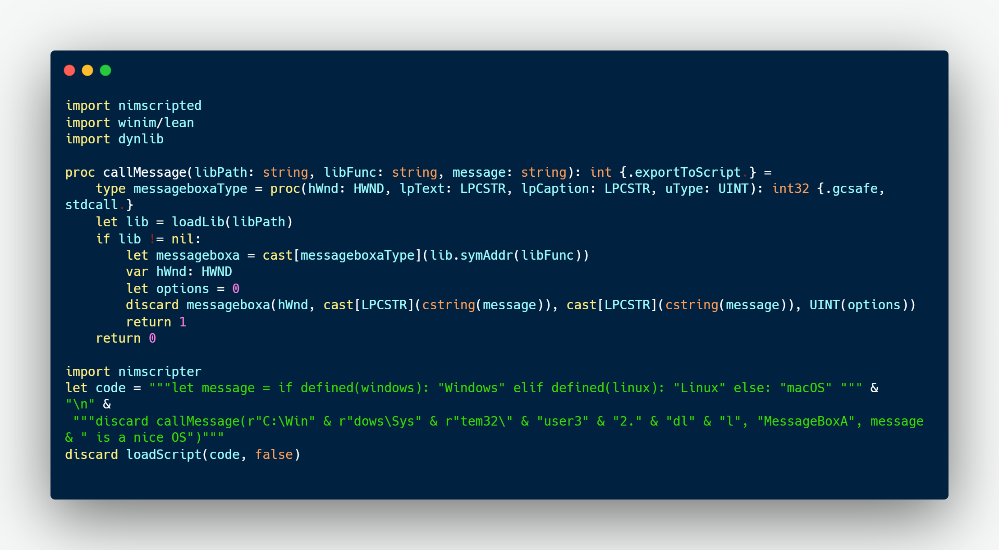
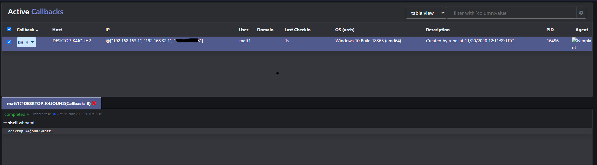
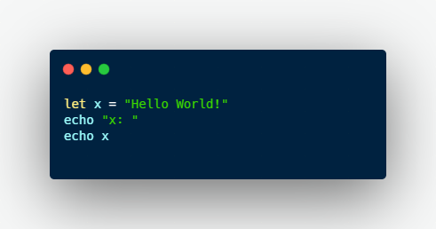
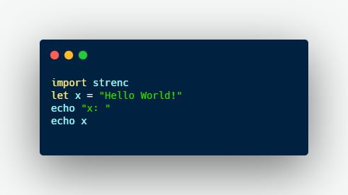

### Introduction

When creating an implant what language first comes to mind? Of course the answer is it depends;
however, typically it is one of the following languages: C, C++, C#, Rust, Go, maybe even Python.
While those languages are all dandy, they are not the only programming languages that exist.
Throughout this series I will be exploring different languages and seeing what
they bring to the table for implant & offensive tool development.
The first language that will be examined is [Nim](https://nim-lang.org/).

### What is Nim

If we visit [Nim's Github page](https://github.com/nim-lang/Nim) there is a concise definition of what Nim is,
"Nim is a statically typed compiled systems programming language. It combines successful concepts from mature languages like Python, Ada and Modula."
Some of the "big" benefits of Nim are:

    * Cross-Platform: Generated executables support Windows, Linux, BSD, and macOS.
    * Nim can compile to C, C++, Objective-C, and JavaScript.
    * Nim binaries are small and the compiler toolchain allows for a lot of optimizations
    * Nim can interface with other languages through Nim's foreign function interface (FFI) [1]
    * Nim syntax is very quick to pick up and is reminiscent of Python.

[1]: [https://nim-lang.org/docs/backends.html#interfacing-nim-code-calling-the-backend](https://nim-lang.org/docs/backends.html#interfacing-nim-code-calling-the-backend)

Of course, these aren't the only benefits of the language, more will reveal themself as time goes on.

### A Simple Injector

Let's get hands-on with Nim and see how to develop a simple injector.
Below is an implementation of a typical CreateRemoteThread injector:
Instead of having to manually interop with the Windows API via the FFI there
are [Nimble](https://github.com/nim-lang/nimble) packages that contain some Windows API
definitions. The one I tend to use is [Winim](https://github.com/khchen/winim).
Winim can also [interop with COM](https://khchen.github.io/winim/com.html).



Let's compile, run the program,

```
nim c --run crtinjection.nim
```

and make sure everything works. By default when you compile Nim code it generates
C code. In the latter section "Integrating into Existing Tooling" verification shall
ensue.

As an aside, if you do not want to use 3rd party packages that is fine if you examine
what Winim does under the hood for example when [calling CreateRemoteThread](https://github.com/khchen/winim/blob/d300192c588f73dddef26e3c317f148aa23465c3/winim/inc/winbase.nim#L1942).
It is simply importing the function for us as denoted by the [importc pragma](https://nim-lang.org/docs/manual.html#foreign-function-interface-importc-pragma)
as that allows us to import a proc or a variable from C. Also, available for importing
from foreign languages are: `.importc`, `.importobjc`, and `importjs`.

CreateRemoteThread proc:

`proc CreateRemoteThread*(hProcess: HANDLE, lpThreadAttributes: LPSECURITY_ATTRIBUTES, dwStackSize: SIZE_T, lpStartAddress: LPTHREAD_START_ROUTINE, lpParameter: LPVOID, dwCreationFlags: DWORD, lpThreadId: LPDWORD): HANDLE {.winapi, stdcall, dynlib: "kernel32", importc.}`

### Peaking under the Hood

What is going on under the hood is quite interesting. If we inspect the executable's IAT we see
there are no static imports for OpenProcess, VirualAllocEx, WriteProcessMemory, and CreateRemoteThread.
That is because Nim is dynamically loading the required libraries with LoadLibraryA and GetProcAddress.
Furthermore, when compiled Nim will place the source code of the language you are targeting in a folder
called nimcache. You can also specify the nimcache path for generated files with the compiler flag
`--nimcache:PATH`.

Below is a snippet of generated code for inject.nim
To make this easier to read I have compiled the program with an additional flag `--embedsrc:on` this flag tells the Nim compiler
to embed the source code as comments in the generated output. For compilation:

```
nim c --run --hints:on --d:release --embedsrc:on inject.nim
```

Snippet of generated C source code that performs injection:



Here we can inspect what our function calls are doing under the hood, the
Windows API calls done by winim rely on the [dynlib module](https://nim-lang.org/docs/dynlib.html) to dynamically
invoke calls. If we inspect that source code we can see
the LoadLibraryA and GetProcAddress combination.



### Nim and Donut

Coming from C# one of my favorite tools for crafting payloads is [Donut](https://github.com/theWover/Donut).
One of the great features with Donut is that it not only works with .NET assemblies but also with native DLLs
and executables. Since Nim can generate both C and C++ source code and link it to a native executable or DLL
Donut is an amazing utility that can transform our output to shellcode.
Since shellcode is language-agnostic we can easily integrate it into other tooling.

### Integrating into Existing Tooling

With shellcode you can easily integrate it into your own custom injectors in the language of your choice.
Of course since these are native executables and DLL's we can also perform manually mapping and load them into memory.
Coming from C# my goto tools to perform the manual mapping are [Lunar](https://github.com/Dewera/Lunar)
and the [D/Invoke tooling in SharpSploit](https://github.com/cobbr/SharpSploit/tree/master/SharpSploit/Execution/DynamicInvoke).

Let's compile the injector code as a DLL and export an inject function.
To export the function we need to tell Nim to export it by adding the
following pragmas: `exportc, dynlib, and cdecl. or stdcall.`
The resulting inject proc is as follows:
`proc inject(pid: int): bool {.stdcall, exportc, dynlib.} = ` <br/>
Let's compile the DLL as follows:

```
nim c --d:release --app:lib --opt:size --inject.nim
```

With the DLL let's manually map it using SharpSploit's D/Invoke tooling.
If you specifically just want the D/Invoke part you can also use the [repository](https://github.com/TheWover/DInvoke)
or [nuget package](https://www.nuget.org/packages/DInvoke/) for solely D/Invoke.

Manual Map Code:



Let's run it and make sure our crt injector proc is executed properly.



### Embedding NimScript with Nimscripter

Within Nim there is an evolving scripting language known as NimScript.
In the NimScript [documentation](https://nim-lang.org/docs/nims.html) it is defined as,
"the subset of Nim that can be evaluated by Nim's built-in virtual machine (VM)."
NimScript is typically used as a configuration language in a devops role for example to run tests and build projects.
However, one of the biggest caveats with NimScript as stated within the documentation,
Nim's [FFI (foreign function interface)](https://nim-lang.org/docs/backends.html#interfacing-nim-code-calling-the-backend) is not available in NimScript.
This means that any stdlib module which relies on importc cannot be used in the VM."
Nim's FFI is how Nim can call other functions written in other programming languages, which is basically
Nim's cross-platform version [P/Invoke](https://docs.microsoft.com/en-us/dotnet/standard/native-interop/pinvoke).
A possible solution is to write the FFI functionality in Nim and expose to NimScript.

Does that mean NimScript is not viable? Absolutely not,
especially with the slow shift in which especially for implant development
it's not always ideal to statically embed everything. Instead leaning towards a lightweight
implant that can dynamically resolve commands within memory so even if an analyst
obtains the binary, not everything is revealed.

There are a couple open source projects: ([https://github.com/komerdoor/nim-embedded-nimscript](https://github.com/komerdoor/nim-embedded-nimscript)
and [https://github.com/Serenitor/embeddedNimscript](https://github.com/Serenitor/embeddedNimscript)) that show how to use
NimScript as an embedded scripting language.

However, those repositories while noble do not easily allow the user to expose Nim code to NimScript and
is much more simplistic.
Luckily, a new repository known as [Nimscripter](https://github.com/beef331/nimscripter) allows for easy interoperability between Nim and NimScript.

Below is an example in which the FFI specific code to call `MessageBoxA` is exposed to NimScript allowing
us to pass in a string of NimScript to invoke the Nim proc.



In a nutshell, what is happening under the hood is the
[script is loaded](https://github.com/beef331/nimscripter/blob/master/src/nimscripter.nim#L140) and the main body is evaluated which allows us to access symbols it exposes.
A small caveat is that you need to include Nim's stdlib as an external folder; luckily, dependening on what modules
you are you using from stdlib you don't to include it in its entirety.
If you would like to read more about embedding NimScript as well as just learn more about NimScript, I encourage you to check out this wonderful series:
[https://peterme.net/using-nimscript-as-a-configuration-language-embedding-nimscript-pt-1.html](https://peterme.net/using-nimscript-as-a-configuration-language-embedding-nimscript-pt-1.html).

### Putting the Pieces Together

While a simple injector is cool let's see how hard it is to develop an implant
in Nim. Luckily, just within Nim's cross-platform [stdlib](https://nim-lang.org/docs/lib.html) is everything needed to create a basic implant
from the FFI for API calls, httpclient for http requests, and stellar json support as a medium for data. The C2 I chose to develop the implant for is [Mythic](https://github.com/its-a-feature/Mythic), Mythic
is very sophisticated and well structured. Furthermore, implants are essentially plug and play as everything is
dockerized and your agent just needs to communicate back and forth via certain rest api endpoints.

Sprouting a few weeks later [Nimplant](https://github.com/MythicAgents/Nimplant) is born.


Nimplant is a cross-platform Linux and Windows implant for Mythic C2 that is fully asynchronous
with the agent able to generate both C and C++. Currently it just has basic functionality; however, it will be updated
over time and become much more sophisticated. If you would like to read more about Nimplant
feel free to read the [project's documentation](https://github.com/MythicAgents/Nimplant/tree/master/documentation-payload/).

Example Nimplant checkin:



### Obfuscation

With Nim, there are ample opportunities throughout the development cycle to introduce obfuscation.
Three key areas that I will highlight are:

**Note: Of course these aren't the only forms of obfuscation you can do just a small subset.**

<div>
  <h4>1. Code Obfuscation</h4>
</div>

With Nim opportunities for code obfuscation are ripe, two quick and easy nimble packages
you can utilize are: [nim-strenc](https://github.com/Yardanico/nim-strenc) and [nuglifier](https://github.com/Yardanico/nuglifier).
Let's just apply nim-strenc to the string literal and view the resulting C file in
our Nimcache.

Before:



After:



When compiling the creator of strenc recommends turning hints off and stripping the binary so we shall do that.

```
nim c --run --hints:off --d:release --passL:-s
```

`--passL` will pass an option to the linker and we are passing `-s` to the GCC linker to perform stripping.
Within the Nimcache folder, go to hello_r and view the file `@mhello.nim.c`.
Inside that file we can see both string literals after they have been xor encrypted:

```c
STRING_LITERAL(TM__xLHv575t3PG1lB5wK05Xqg_3, "\207\251\241\236\234\320\246\231\205\230\221\333", 12);
STRING_LITERAL(TM__xLHv575t3PG1lB5wK05Xqg_4, "\360\275\246", 3);
```

With nim-strenc if you look at the codebase it's less than 30 lines.
It's applying a compile-time macro that xor encrypts
every string literal. For more information about compile-time macros
and how they can be leveraged for obfuscation read this [forum post](https://wasm.in/blogs/meta-programmirovanie-nim-i-obfuskacija.706) (you will most likely need Google Translate for it.)

<div>
  <h4>2. LLVM Obfuscation</h4>
</div>

For more in-depth obfuscation LLVM obfuscation can be utilized.
There are two routes you can down as

The easier of the two routes is to use [nlvm](https://github.com/arnetheduck/nlvm)
to generate the intermediate representation (IR). Although, currently nlvm has some limitations so keep that in mind
when trying to convert your program to IR. With the IR, you can do in-tree or out-of-tree LLVM obfuscation
with tools such as [YANSOllvm](https://github.com/emc2314/YANSOllvm) and [dumb-obfuscator](https://github.com/thebabush/dumb-obfuscator).
A note with YANSOllvm is that since it is in-tree obfuscation passes
and does deeper changes you will need to build the entire [LLVM framework](https://llvm.org/) which
may take upwards of an hour.

The other route is to take the generated C/C++ code transform to IR such as with clang
and perform the in-tree or out-of-tree obfuscation and then link it all back together.
Depending on the complexity of your program you may end up working with multiple files
and have to make sure it's properly linked.

**I will leave this to the reader to experiment with**

<div>
  <h4>3. IAT Manipulation</h4>
</div>

If we throw the executable into a PE analyzer such as pe-studio or PE-bear we can see some imports
that could raise some flags for static analysis. Especially the following imports:
"LoadLibraryA and GetProcAddress", to help bypass static analysis we can use tools
such as [CallObfuscator](https://github.com/d35ha/CallObfuscator). For example,
you can manipulate the IAT so the thunk that points to LoadLibraryA will point to
NotLoadLibrarayA and the thunk for GetProcAddress to NotGetProcAddress.

### Looking Towards the Future

While I covered a fair amount of things you can do with Nim, this is far from everything.
Some things down the road that I plan to research are:

- Nim's interoperability with Go such as with [golib-nim](https://github.com/stefantalpalaru/golib-nim)
- Adding more features to Nimplant and making it fully cross-platform with an option to
  compile to Objective-C for a macOS agent
- Researching & Creating alternative methods for dynamic invocation of Windows APIs without using LoadLibrary and GetProcAddress

### Conclusion

Overall, Nim is an interesting language that can jumpstart development without
having to be bogged down by the interwoven intricacies of languages such as C++ and Rust.
Nim is a jumper cable that allows you to be versatile with the benefit of being cross-platform with a minimal
final binary size. Where obfuscation is ripe as well, Nim may slowly rise in popularity
over the next few years; although, [APTs are already using it](https://securelist.com/zebrocys-multilanguage-malware-salad).
All code snippets except for the strenc and auto-generated C code can be found [here](https://github.com/NotoriousRebel/NimbleMusings).

### Special Thanks

This post wouldn't be possible without the help of a few amazing people.

- [@bohops](https://twitter.https://twitter.com/bohops)
  Thank you for the motivation and for providing interesting insights
  to fuel implant development as well as Nim tradecraft.
- [@theWover](https://twitter.com/TheRealWover)
  Thank you for inspiring Nimplant and for some amazing talks
  bouncing some really fun ideas to advance Nim tradecraft.

- [@its_a_feature\_](https://twitter.com/its_a_feature_)
  Thank you for all the help with Nimplant's development, answering
  any question along the way and helping with late-night debugging sessions.

### References

[https://nim-lang.org/docs/manual.html](https://nim-lang.org/docs/manual.html)

[https://nim-lang.org/docs/nims.html](https://nim-lang.org/docs/nims.html)

[https://peterme.net/using-nimscript-as-a-configuration-language-embedding-nimscript-pt-1.html](https://peterme.net/using-nimscript-as-a-configuration-language-embedding-nimscript-pt-1.html)

[https://thewover.github.io/Dynamic-Invoke/](https://thewover.github.io/Dynamic-Invoke/)
